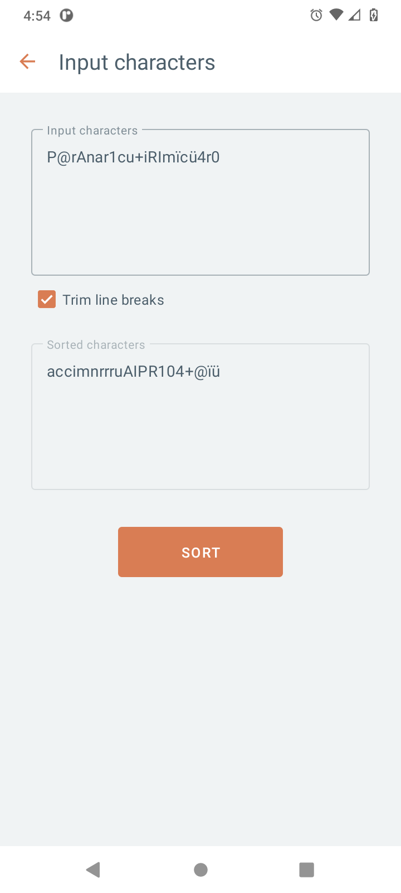
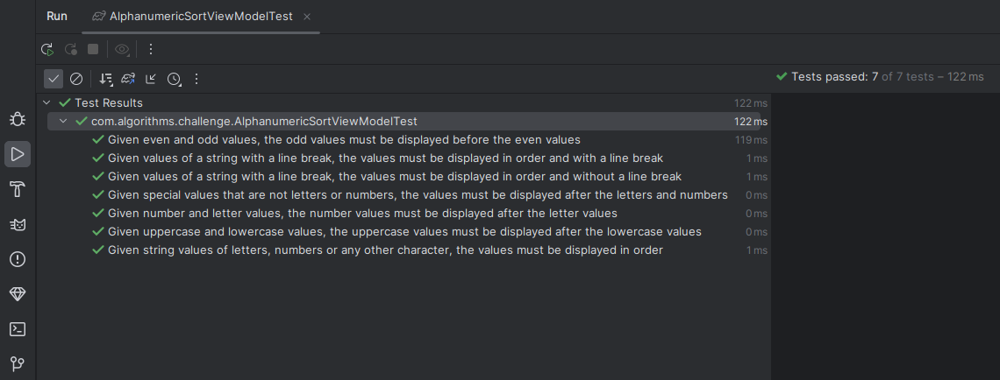

# 01 - Alphanumeric String Sort

Taking a string as input, sort the string characters with the following rules:

- Numbers go after letters
- Uppercase letters go after Lowercase
- Odd numbers go before Even numbers
- Any character that is not a letter or number should go after letters and numbers 

## Screenshot

## Unit tests
